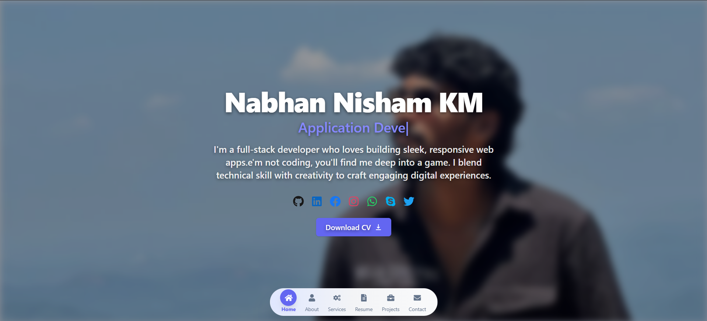

# 🚀 Personal Portfolio – Nabhan Nisham K M

Welcome to my personal portfolio! This project is built using **React**, **Vite**, and **Tailwind CSS**. It's a showcase of my skills, projects, experience, and achievements as a web developer.

 <!-- You can add an actual screenshot or remove this line -->

## 🛠 Tech Stack

- ⚛️ **React** – Frontend Library
- ⚡ **Vite** – Super-fast build tool
- 🎨 **Tailwind CSS** – Utility-first CSS framework
- 🧪 **ESLint** – Code quality and linting
- 🧰 **Git & GitHub** – Version control and project hosting

## 📁 Features

- Responsive and mobile-friendly design
- Smooth scroll navigation
- Animated UI elements with Tailwind
- Modular and reusable component structure
- Sections include:
  - About Me
  - Skills & Tools
  - Projects
  - Experience
  - Education
  - Contact

## 📷 Preview


## 🧑‍💻 Getting Started

```bash
# Clone the repository
git clone https://github.com/NABHAN-NISHAM-KM/your-portfolio.git
cd your-portfolio

# Install dependencies
npm install

# Run the development server
npm run dev

📦 Build for Production
npm run build

📬 Contact
Feel free to connect with me:

💼 LinkedIn: www.linkedin.com/in/nabhannishamkm

📧 Email: nabhannisham5@gmail.com


🧠 Made with passion and purpose.
⭐ If you like this project, consider giving it a star!

---

Let me know if you'd like to localize it, add deployment instructions (e.g., GitHub Pages, Vercel), or write it in another style (fun, formal, developer-oriented, etc.).
